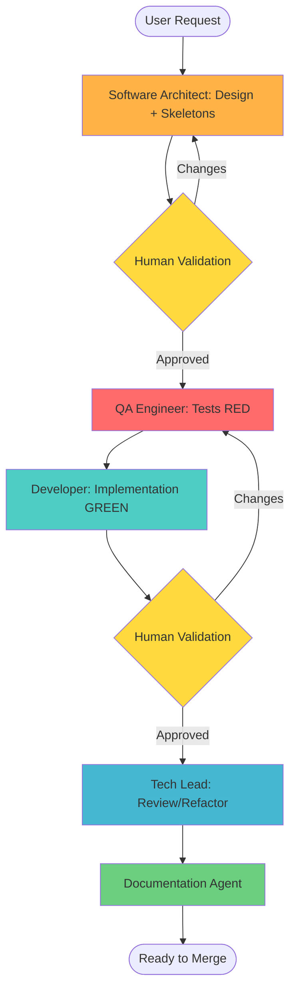

# Agent Workflow Orchestration - Intelligent Heating Pilot

## Overview

This workflow enforces DDD, SOLID, and TDD with explicit human validation gates.

## Workflow Diagram

## Phase Details

### Phase 1: Software Architect (Design + Skeletons)
- Define domain model, interfaces, types, and class/method skeletons
- No implementation logic in method bodies
- Align with Home Assistant best practices
- Deliver acceptance criteria and test scenarios

### Phase 2: QA Engineer (TDD RED)
- Write unit tests for domain logic
- Write integration/E2E-minimum tests for cross-layer behavior
- Run tests with Poetry to confirm RED state

### Phase 3: Developer (TDD GREEN)
- Implement code to satisfy tests and contracts
- Keep domain pure and follow DDD boundaries
- Run tests with Poetry until green

### Phase 4: Tech Lead (Review/Refactor)
- Review for maintainability and SOLID compliance
- Refactor safely; keep tests green
- Coordinate with QA/Architect if changes are needed

### Phase 5: Documentation Agent
- Update user and contributor docs
- Keep documentation DRY and focused

## Human Validation Gates

- **Gate 1**: After Software Architect design
- **Gate 2**: After Developer implementation

No further phases proceed without approval.
