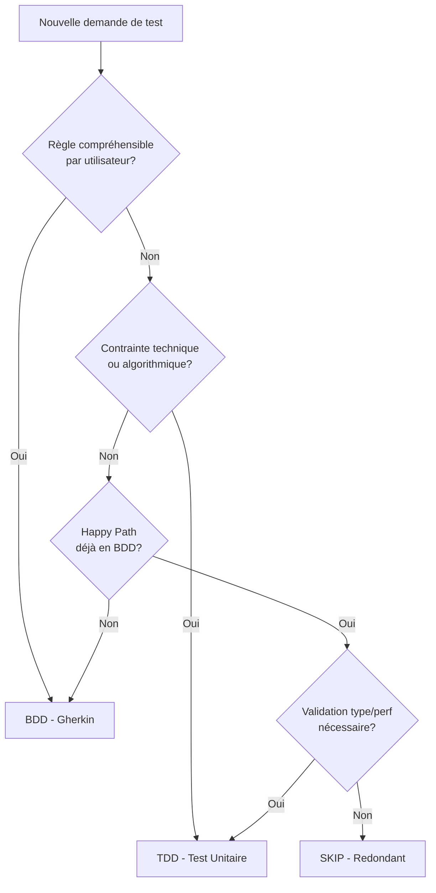

# Stratégie de Test Hybride BDD/TDD - Intelligent Heating Pilot

## 🎯 Vue d'Ensemble

Cette stratégie définit **quand** et **comment** utiliser Pytest-BDD (Behavior-Driven Development) et Pytest Unitaires (Test-Driven Development) pour maximiser la clarté, la maintenabilité et éviter la redondance.

### Principe Fondamental : Séparation Black Box / White Box

```
┌─────────────────────────────────────────────────────────────┐
│  MÉTIER (Quoi)           →  Pytest-BDD (Gherkin)           │
│  Black Box Testing       →  Comportement observable        │
│  Compréhensible par utilisateur / Product Owner            │
└─────────────────────────────────────────────────────────────┘

┌─────────────────────────────────────────────────────────────┐
│  TECHNIQUE (Comment)     →  Pytest Unitaires               │
│  White Box Testing       →  Robustesse, cas limites        │
│  Compréhensible par développeurs / QA technique             │
└─────────────────────────────────────────────────────────────┘
```

---

## 📋 Règles de Décision : BDD ou TDD ?

### ✅ Utiliser Pytest-BDD (Gherkin) QUAND

1. **Règle Métier Observable**
   - La fonctionnalité peut être expliquée à un utilisateur non-technique
   - Exemple: "Le cache renvoie la donnée déjà calculée"
   - Exemple: "La donnée expire après le TTL configuré"

2. **Happy Path & Scénarios Utilisateur**
   - Parcours nominal d'utilisation
   - Exemple: "Quand le cache est rempli et qu'on demande une donnée, elle est retournée sans calcul"

3. **Interactions de Haut Niveau**
   - Validation des collaborations entre composants
   - Exemple: "Le storage n'est pas appelé lors d'un cache-hit"
   - **Autorisation de mocks** : Uniquement pour vérifier les interactions observables

4. **Critères d'Acceptation Produit**
   - Validation d'une story user ou d'une feature demandée
   - Exemple: "Après 24h, le cache est automatiquement évincé"

### ✅ Utiliser Pytest Unitaires (TDD) QUAND

1. **Cas Limites (Edge Cases)**
   - Valeurs nulles, vides, extrêmes
   - Exemple: `test_eviction_with_empty_cache()`
   - Exemple: `test_datetime_parsing_with_none()`

2. **Gestion d'Exceptions & Erreurs**
   - Erreurs système, erreurs de droits, timeouts
   - Exemple: `test_storage_raises_on_disk_full()`
   - Exemple: `test_cascade_continues_despite_lhs_error()`

3. **Logique Algorithmique Pure**
   - Calculs mathématiques, transformations de données
   - Exemple: `test_lhs_calculation_with_different_slopes()`
   - Exemple: `test_fifo_eviction_preserves_order()`

4. **Validation de Type & Mémoire**
   - Vérification de types de retour spécifiques
   - Exemple: `test_returns_optional_none_when_cache_empty()`
   - Exemple: `test_memory_usage_within_limits()`

5. **Robustesse Technique**
   - Résistance aux pannes, dégradations gracieuses
   - Exemple: `test_falls_back_to_global_lhs_when_contextual_missing()`

---

## 🚫 Règle de Non-Redondance

### ⚠️ NE PAS DUPLIQUER les Tests

**Si un Happy Path est couvert par un scénario BDD, ne pas créer de test unitaire équivalent.**

#### Exemple : Redondance à Éviter

```gherkin
# tests/features/cache.feature
Scenario: Cache hit returns data without calculation
  Given the cache contains data for "device_1" from "2026-01-01"
  When I request data for "device_1" from "2026-01-01"
  Then the data is returned immediately
  And no calculation is performed
```

```python
# ❌ REDONDANT - Ne pas créer ce test unitaire
def test_cache_hit_returns_data():
    """This duplicates the BDD scenario above."""
    cache = create_cache_with_data("device_1", "2026-01-01")
    result = cache.get("device_1", "2026-01-01")
    assert result is not None
```

### ✅ Exception : Validation Spécifique Non-Exprimable en BDD

Les tests unitaires sont **autorisés** même si le happy path est en BDD, **UNIQUEMENT** pour :

1. **Validation de type stricte**
   ```python
   def test_cache_returns_heatingcycle_instance():
       """BDD can't verify type; unit test validates isinstance."""
       result = cache.get("device_1", date(2026, 1, 1))
       assert isinstance(result, HeatingCycle)
   ```

2. **Contraintes mémoire/performance**
   ```python
   def test_cache_lookup_completes_under_10ms():
       """Performance constraint not verifiable in BDD."""
       start = time.perf_counter()
       cache.get("device_1", date(2026, 1, 1))
       assert (time.perf_counter() - start) < 0.01
   ```

---

## 🔍 Processus de Décision : Analyse de Contexte Avant Génération

### Workflow Obligatoire pour QA Engineer



### Questions à se Poser (Checklist)

Avant de créer un test, répondre à ces questions :

1. **Est-ce que cette règle peut être expliquée à un Product Owner ?**
   - ✅ Oui → **BDD**
   - ❌ Non → Continuer

2. **Est-ce une contrainte d'ingénierie (type, perf, edge case, exception) ?**
   - ✅ Oui → **TDD Unitaire**
   - ❌ Non → Continuer

3. **Est-ce un happy path déjà couvert par BDD ?**
   - ✅ Oui → **SKIP (sauf validation type/perf)**
   - ❌ Non → **BDD**

---

## 📦 Organisation des Tests dans le Projet

### Structure des Répertoires

```
tests/
├── features/                       # BDD - Comportement métier
│   ├── cache_cascade.feature      # Scénarios Gherkin
│   ├── lazy_contextual_lhs.feature
│   ├── memory_cache_eviction.feature
│   ├── conftest.py                # Fixtures partagées pytest-bdd
│   └── test_*_steps.py            # Step definitions
│
└── unit/                          # TDD - Tests techniques
    ├── domain/                    # Logique métier pure
    │   ├── test_value_objects.py  # Edge cases, validation types
    │   └── test_services.py       # Algorithmes, calculs
    │
    ├── application/               # Orchestration
    │   ├── test_cascade_error_isolation.py  # Gestion erreurs
    │   └── test_memory_cache_eviction.py    # Edge cases FIFO
    │
    └── infrastructure/            # Adapters HA
        └── test_storage_adapters.py  # Erreurs I/O, fallbacks
```

### Exemples Concrets par Catégorie

#### BDD - Comportement Métier (Black Box)

```gherkin
# tests/features/cache_cascade.feature
Feature: LHS Cascade with Error Isolation
  As a system
  I want to continue computing contextual LHS even if global LHS fails
  So that individual room preheating still benefits from learning

  Scenario: Global LHS failure does not block contextual LHS
    Given a heating cycle has completed
    When the global LHS calculation fails
    Then the contextual LHS is still computed
    And the error is logged
```

**Rationale** : Un Product Owner peut comprendre "l'erreur sur une donnée globale ne doit pas bloquer les données individuelles par pièce".

#### TDD - Edge Cases & Robustesse (White Box)

```python
# tests/unit/application/test_cascade_error_isolation.py
@pytest.mark.asyncio
async def test_cascade_continues_with_none_cycles():
    """Edge case: Cascade called with None should not crash."""
    manager = create_manager_with_mocks()
    await manager._trigger_lhs_cascade(cycles=None)  # Should handle gracefully
    # Verify no exception raised

@pytest.mark.asyncio
async def test_cascade_logs_detailed_exception_context():
    """Technical constraint: Exception must include device_id and date."""
    mock_global_lhs.calculate.side_effect = ValueError("Disk full")
    await manager._trigger_lhs_cascade([cycle])
    # Verify log contains device_id and date for debugging
    assert "device_1" in captured_log
    assert "2026-01-01" in captured_log
```

**Rationale** : Contraintes techniques (crash prevention, debug info) non-exprimables en Gherkin.

---

## 🧹 Refactoring : Harmonisation des Tests Existants

### Processus de Review par le QA Engineer

Lorsqu'une demande d'harmonisation est faite :

1. **Identifier les Redondances**
   - Lister les tests unitaires qui dupliquent des scénarios BDD
   - Exemple : `test_cache_hit()` unitaire vs `Scenario: Cache hit` BDD

2. **Catégoriser les Tests**
   - **Garder** : Tests unitaires techniques (edge cases, exceptions)
   - **Supprimer** : Tests unitaires redondants avec BDD
   - **Convertir** : Tests unitaires de happy path → Scénarios Gherkin

3. **Appliquer la Stratégie**
   - Créer/déplacer scénarios BDD si nécessaire
   - Supprimer tests unitaires redondants
   - Conserver tests techniques de robustesse

4. **Valider la Couverture**
   - Exécuter `poetry run pytest --cov` pour vérifier couverture >80%
   - Vérifier que tous les critères d'acceptation ont un scénario BDD
   - Vérifier que tous les edge cases ont un test unitaire

### Exemple de Refactoring

#### Avant (Redondance)

```python
# tests/unit/application/test_memory_cache.py
def test_cache_returns_stored_cycle():  # ❌ REDONDANT avec BDD
    cache = MemoryCache()
    cycle = create_test_cycle()
    cache.store(cycle)
    result = cache.get(cycle.device_id, cycle.date)
    assert result == cycle

def test_cache_evicts_oldest_when_full():  # ✅ GARDER (algorithme FIFO)
    cache = MemoryCache(max_size=50)
    for i in range(51):
        cache.store(create_cycle(f"device_{i}"))
    assert cache.size() == 50
    assert "device_0" not in cache  # Oldest evicted
```

```gherkin
# tests/features/memory_cache.feature
Scenario: Cache returns stored cycle  # ✅ GARDER (happy path)
  Given a cycle is stored in cache
  When I request that cycle
  Then it is returned
```

#### Après (Harmonisé)

```python
# tests/unit/application/test_memory_cache_eviction.py
def test_eviction_preserves_fifo_order():  # ✅ GARDER (algorithme technique)
    """Test FIFO eviction algorithm correctness."""
    cache = MemoryCache(max_size=3)
    cache.store(create_cycle("A", date(2026, 1, 1)))
    cache.store(create_cycle("B", date(2026, 1, 2)))
    cache.store(create_cycle("C", date(2026, 1, 3)))
    cache.store(create_cycle("D", date(2026, 1, 4)))  # Triggers eviction

    assert "A" not in cache  # First-in evicted
    assert ["B", "C", "D"] == list(cache.keys())  # Order preserved

def test_eviction_with_zero_size_cache():  # ✅ GARDER (edge case)
    """Edge case: Cache with size 0 should not crash."""
    cache = MemoryCache(max_size=0)
    cache.store(create_cycle("A", date(2026, 1, 1)))
    assert cache.size() == 0  # Nothing stored
```

```gherkin
# tests/features/memory_cache_eviction.feature
Scenario: Oldest cycle evicted when cache full  # ✅ GARDER (comportement métier)
  Given a cache with 50 entries
  When a new cycle is added
  Then the oldest cycle is evicted
  And the cache size remains 50
```

**Résultat** :
- ❌ Supprimé : `test_cache_returns_stored_cycle()` (duplique scénario BDD)
- ✅ Conservé : Tests d'algorithme FIFO et edge cases
- ✅ Conservé : Scénario BDD pour comportement observable

---

## 🎓 Mocks : Quand et Comment ?

### Règles d'Usage des Mocks

#### Dans les Tests BDD (Pytest-BDD)

**✅ AUTORISER** les mocks pour :
1. **Vérifier les interactions de haut niveau**
   ```python
   # Verify storage is NOT called on cache hit
   mock_storage.get_cache_data.assert_not_called()
   ```

2. **Simuler dépendances externes**
   ```python
   # Mock Home Assistant scheduler state
   mock_scheduler.get_next_event.return_value = ScheduleEvent(...)
   ```

**❌ ÉVITER** les mocks pour :
- Vérifier la logique interne (c'est du White Box → TDD)
- Valider le comportement de classes testées (tester contre l'interface réelle)

#### Dans les Tests Unitaires (TDD)

**✅ UTILISER SYSTÉMATIQUEMENT** les mocks pour :
1. **Isoler la classe testée**
   ```python
   mock_storage = Mock(spec=IHeatingCycleStorage)
   manager = HeatingCycleLifecycleManager(storage=mock_storage)
   ```

2. **Simuler erreurs/exceptions**
   ```python
   mock_storage.save.side_effect = IOError("Disk full")
   ```

3. **Vérifier appels et paramètres**
   ```python
   mock_lhs_service.calculate.assert_called_once_with(
       cycles=expected_cycles,
       force_recalculate=False
   )
   ```

---

## 📊 Exemples Complets : Cache System

### BDD - Comportement Observable

```gherkin
# tests/features/lazy_contextual_lhs.feature
Feature: Lazy Contextual LHS Population
  As a system
  I want to compute contextual LHS only when needed
  So that I save compute resources

  Scenario: Contextual LHS not computed if already in cache
    Given the contextual LHS cache is populated for "device_1"
    When I request contextual LHS for "device_1"
    Then no calculation is performed
    And the storage is not accessed

  Scenario: Contextual LHS computed and stored when missing
    Given the contextual LHS cache is empty for "device_1"
    When I request contextual LHS for "device_1"
    Then the LHS is calculated for all 24 hours
    And the result is stored in persistent storage
```

### TDD - Robustesse Technique

```python
# tests/unit/application/test_lazy_contextual_lhs_population.py

@pytest.mark.asyncio
async def test_ensure_contextual_lhs_handles_none_cycles():
    """Edge case: None cycles should not crash lazy population."""
    manager = create_lhs_manager_with_mocks()
    await manager.ensure_contextual_lhs_populated(cycles=None)
    # Should not raise exception

@pytest.mark.asyncio
async def test_ensure_contextual_lhs_handles_storage_error():
    """Exception handling: Storage failure should not block calculation."""
    mock_storage.save_contextual_lhs.side_effect = IOError("Permission denied")

    manager = create_lhs_manager_with_mocks()
    result = await manager.ensure_contextual_lhs_populated([cycle])

    # Calculation should succeed despite storage failure
    assert result is not None
    # Error should be logged
    assert "Permission denied" in captured_log

@pytest.mark.asyncio
async def test_force_recalculate_bypasses_cache():
    """Algorithmic validation: force_recalculate flag works correctly."""
    manager = create_lhs_manager_with_mocks()
    manager._memory_lhs_cache = {"device_1": existing_lhs}  # Pre-populate

    await manager.ensure_contextual_lhs_populated(
        cycles=[cycle],
        force_recalculate=True
    )

    # Should calculate despite cached value
    mock_calculator.calculate.assert_called_once()
```

---

## ✅ Checklist de Validation pour QA Engineer

Avant de soumettre des tests pour review, vérifier :

### Pour chaque fichier `.feature` (BDD)
- [ ] Les scénarios décrivent un **comportement observable** (pas d'implémentation)
- [ ] Un Product Owner peut **lire et comprendre** chaque scénario
- [ ] Les `Given/When/Then` sont **métier**, pas techniques
- [ ] Pas de détails d'implémentation (ex: "le cache utilise un dict Python")
- [ ] Les step definitions utilisent des **mocks uniquement pour les interactions**

### Pour chaque test unitaire
- [ ] Le test couvre un **cas limite**, une **exception** ou un **algorithme**
- [ ] Le test n'est **PAS redondant** avec un scénario BDD
- [ ] Le test utilise des **mocks pour isoler** la classe testée
- [ ] Le nom du test décrit **clairement** le cas technique validé
- [ ] Le test est **rapide** (<100ms) et **déterministe**

### Couverture globale
- [ ] Tous les **critères d'acceptation** ont un scénario BDD
- [ ] Tous les **edge cases** ont un test unitaire
- [ ] Couverture de code **>80%** (vérifier avec `pytest --cov`)
- [ ] Pas de **duplication** entre BDD et TDD
- [ ] Documentation claire sur **pourquoi** chaque test existe

---

## 🚀 Application dans le Workflow

### Phase QA Engineer (RED)

1. **Analyser la demande**
   - Lire les critères d'acceptation
   - Identifier : Métier (BDD) vs Technique (TDD)

2. **Créer les tests BDD d'abord**
   - Écrire les `.feature` pour les comportements observables
   - Créer les step definitions avec mocks minimaux

3. **Créer les tests unitaires ensuite**
   - Ajouter tests pour edge cases non-exprimables en BDD
   - Ajouter tests pour robustesse (exceptions, errors)
   - **Vérifier non-redondance** avec les scénarios BDD

4. **Valider la couverture**
   - Exécuter `poetry run pytest --cov`
   - Vérifier que TOUS les tests sont RED
   - Documenter les gaps de couverture si besoin

---

## 📖 Références

- [pytest-bdd Documentation](https://pytest-bdd.readthedocs.io/)
- [Gherkin Best Practices](https://cucumber.io/docs/gherkin/reference/)
- [Test Pyramid (Martin Fowler)](https://martinfowler.com/articles/practical-test-pyramid.html)
- IHP Project: `.github/copilot-instructions.md` - Section TDD/BDD

---

**Version** : 1.0 (13 février 2026)
**Auteur** : IHP Development Team
**Révision** : QA Engineer obligé de suivre ces règles pour toutes futures contributions
